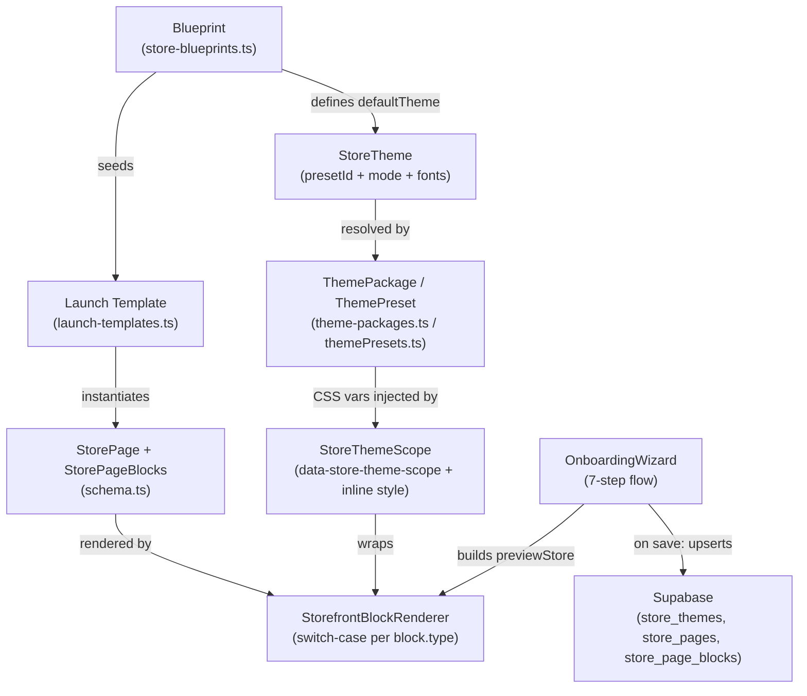

# Template Engine, Theme System & Page Builder Analysis
> COMMERCE Engine — `src/` — July 2026

---

## 1. Current Architecture (How It All Fits Together)

The system is split into **three clean layers** that work together during store creation and rendering.

### Key Mechanics

| Layer | File | Role |
|---|---|---|
| **Blueprint** | `store-blueprints.ts` | Defines 7 store archetypes (clothing, food, gadgets, etc.) each with default theme preset, recommended block set, payment defaults, and onboarding steps |
| **Launch Template** | `launch-templates.ts` | Provides full pre-written page + block content for 3 legacy templates (clothing, food, general) |
| **Schema** | `schema.ts` | Zod-typed shapes for `StoreTheme`, `StorePageBlock` (11 block types), `StorePage`, `Store` |
| **Theme Preset** | `themePresets.ts` | 12 named HSL-based dark/light token sets (Emerald Dark, Midnight Blue, Rose Gold, etc.) |
| **Theme Packages** | `theme-packages.ts` | Extended theme units (typography, borderRadius, customCss, version, mode) that bridge presets to the DB `store_themes` table |
| **Theme Application** | `StoreThemeScope.tsx` + `store-theme-style.ts` | Injects resolved CSS custom properties as inline `style` on a scoped `div`, applies `customCss` inside a `<style>` tag |
| **Block Rendering** | `StorefrontBlockRenderer.tsx` | Switch-case renderer that maps `block.type` to a React component. Wrapped in `ErrorBoundary` |
| **Builder UI** | `OnboardingWizard.tsx` | 7-step wizard (Blueprint → Brand → Content → Catalog → Theme → Payments → Launch) with a live preview panel that uses `StoreProvider` + `StoreThemeScope` + `StorefrontBlockRenderer` |
| **CMS Library** | `cms-library/` | Admin CRUD UI for Blueprints, Themes, Pages, Blocks in the DB — acts as the "config control plane" |

---

## 2. Current Progress ✅

### ✅ Core Things That Are Built

- **Blueprint System**: 7 blueprints (clothing, gadgets, crafts, food, single-product, general-catalog, inquiry-catalog) with their own block sets, page sets, and default themes. DB-backed with code fallbacks.
- **Theme Preset Library**: 12 complete dark+light HSL token sets baked into code, DB-extendable via `ThemePackage`.
- **Theme Scoping**: `StoreThemeScope` correctly isolates each tenant's theme using `data-store-theme-scope` and inline CSS vars. No global class pollution.
- **Block Type System**: 11 block types, fully Zod-typed and rendered: `hero`, `promo-banner`, `category-showcase`, `featured-products`, `countdown`, `recently-viewed`, `rich-text`, `social-feed`, `video-reel`, `faq-accordion`, `trust-badges`, `testimonials`.
- **Onboarding Wizard (7 steps)**: Fully functional flow that builds a live `previewStore` in-memory, syncs with the right-panel preview, and upserts to Supabase on save.
- **Live Preview in Wizard**: `buildPreviewStore()` uses the current draft state to build a full in-memory `Store` object — the preview panel re-renders on every draft change via `useMemo`.
- **CMS Library Admin Panel**: CRUD forms for all 4 entity types (Blueprint, Theme, Page Blueprint, Block Registry) in `cms-library/`.
- **Block ErrorBoundary**: Every block has isolated error handling — a broken block shows a fallback dashed box rather than crashing the page.
- **Blueprint → Page instantiation**: `instantiateStorePagesFromBlueprint()` creates live `StorePage[]` with UUIDs from a blueprint's `recommendedPageSet` + `recommendedBlockSet`.
- **Catalog Mode Adaptations**: `applyCatalogModeToPages()` rewrites block props based on `single_product` vs `inquiry_only` vs `menu` modes during onboarding.
- **Theme DB persistence**: Saves `colors`, `typography`, `components`, `resolved_tokens`, `custom_css`, `theme_package_id` to `store_themes` on launch.
- **Public `/templates` page**: Static marketing page showing 4 template categories (Fashion, Skincare, Bakery, Gadgets) — **UI only, not wired to the blueprint system yet**.

---

## 3. What's Missing / Architectural Gaps ⚠️

### 🔴 Critical Gaps

| Gap | Details |
|---|---|
| **No post-launch page/block editor** | Once a store is live, there is no way to edit individual blocks or reorder them. The OnboardingWizard is the only editor and it **re-deletes and re-inserts all pages+blocks on every save**, destroying any post-launch edits. |
| **No drag-and-drop block builder** | Blocks are only configurable at launch time inside the wizard. There is no per-block editing UI outside of the onboarding JSON (the `PageBlueprintBlockEditor` in cms-library is for the admin control plane, not per-merchant use). |
| **`/templates` page is static + disconnected** | `src/app/templates/page.tsx` hard-codes 4 marketing cards with no links, no live preview, and no connection to the real blueprint system. A merchant clicking "Start Building" just goes to `/signup`. |
| **`rich-text` body is plain text, not a rich editor** | The `body` field in `rich-text` blocks is a raw `string` parsed with `parseRichTextBody()` — it handles basic `- bullet` prefixes but cannot do headings, bold, links, tables, or images. |
| **Theme customizer doesn't support per-store color overrides** | The wizard lets you pick a `themePackageId` + `mode`, but there's no UI for the merchant to change individual colors (primary, background, accent). `customCssVars` in the schema supports it but the onboarding wizard doesn't expose it. |
| **No block-level visibility toggle UI for merchants** | `isVisible` exists on every block in the schema, but there's no merchant-facing UI to show/hide blocks on their live store. |

### 🟡 Architectural Flaws

| Flaw | Details |
|---|---|
| **Theme scoping is CSS-var only, no class-based dark mode** | `StoreThemeScope` injects vars inline. If a component uses Tailwind `dark:` prefixed classes (which check `document.documentElement.classList`), those won't respond to the store theme mode — they'd follow the system/admin dark mode setting instead. |
| **`store-theme-style.ts` double-applies customCssVars** | Lines 10-17 and 31-33 in `getStoreThemeStyle()` iterate `theme.customCssVars` twice. The second loop is a no-op but is a latent confusion source. |
| **`OnboardingWizard` deletes all pages+blocks on save (line 647-648)** | `await supabase.from("store_page_blocks").delete()...` then `await supabase.from("store_pages").delete()...` runs on every save, including minor edits. This is destructive — no versioning, no diff. |
| **Fallback theme resolution has ambiguous priority** | `getStoreThemeStyle()` checks `customCssVars` → `themePackage.tokens`, but `getStoreThemeStyleFromRecord()` checks `colors` → `resolved_tokens` → `themePackage.tokens`. These are two different code paths with slightly different semantics — the wizard saves `colors` but the storefront renderer may use a different path. |
| **`/templates` page uses hardcoded `bg-slate-950` classes** | The templates marketing page bypasses the theme system entirely. Hardcoded Tailwind colors (`bg-slate-950`, `text-zinc-400`) mean it will never pick up any tenant theming. |
| **No skeleton/loading state in the block renderer** | The `StorefrontBlockRenderer` renders nothing (via `isVisible` check) or the block immediately. For async blocks like `featured-products`, there's no loading state — the content just appears or is missing. |

### 🟢 Minor / UX Gaps

- **No block preview thumbnails in the wizard**: The theme step shows color swatches (good), but the "add a block" flow has no visual preview of what each block type looks like.
- **`/cms-admin/libraries` route stub**: `src/app/cms-admin/libraries/page.tsx` (369 bytes) is likely a stub — the real CMS library editor may not be connected to the admin nav.
- **No template preview before signup**: Users going to `/templates` can't preview a live storefront demo before signing up.
- **No dark/light mode toggle in the preview panel**: The onboarding preview always renders the selected `themeMode` — there's no "toggle preview mode" button.

---

## 4. What to Add — Prioritized Next Steps 🚀

### Priority 1 — Critical for Production Merchants

- **[ P1 ] Merchant Block Editor (post-launch)**: A per-page block management UI in the merchant admin where they can toggle visibility, reorder blocks (drag+drop), and edit block props via form fields — without going through the onboarding wizard again.
- **[ P1 ] Non-destructive page save**: Replace the delete-all-and-reinsert save with an upsert/diff strategy. Only delete blocks that were removed, update modified ones, insert new ones.
- **[ P1 ] Wire `/templates` to blueprints**: Make the templates page dynamically render real blueprint cards with a "Preview" button opening a demo storefront iframe and "Use this template" routing to `/signup?blueprint=clothing`.

### Priority 2 — Core UX Improvements

- **[ P2 ] Per-store color customizer**: Add a color editor in the Theme step (primary, accent, background color pickers) that writes to `customCssVars` → `store_themes.colors`. This enables merchants to truly personalize beyond the 12 presets.
- **[ P2 ] Block visibility toggle in merchant admin**: A simple on/off switch per block on the live page editor, saved back to `store_page_blocks.is_visible`.
- **[ P2 ] Rich text editor (Tiptap or Lexical)**: Replace the plain textarea `body` field in `rich-text` blocks with a proper WYSIWYG editor. The Zod schema would need to change `body: z.string()` to a JSON document model.
- **[ P2 ] Block type preview thumbnails**: In the block-picker (wherever you add blocks post-launch), show a small screenshot or SVG preview of what each block type looks like.

### Priority 3 — Template & Onboarding Polish

- **[ P3 ] Live template demo page**: Create a public `StorePreviewPage` that takes a `blueprintId` query param, instantiates the template in-memory, and renders a full read-only storefront demo for marketing/signup flow.
- **[ P3 ] Dark/light toggle in onboarding preview**: Add a toggle button in the right-panel preview so merchants can see both modes before choosing.
- **[ P3 ] More blueprint types**: Add "booking", "service", and "listing" business families (the `businessFamily` enum already supports them, blueprints just aren't written yet).
- **[ P3 ] Custom domain setup step**: The `customDomain` field exists in `DraftState` and `storeSchema` but there is no UI for it in the onboarding wizard's Brand step.

### Priority 4 — Architecture Hardening

- **[ P4 ] Class-based dark mode for tenant themes**: Add a `data-theme-mode="dark"` attribute on the `StoreThemeScope` wrapper and update Tailwind config to use `darkMode: ['selector', '[data-theme-mode="dark"]']` so Tailwind `dark:` classes respond to the tenant's theme mode, not just the system setting.
- **[ P4 ] Page revision history**: The `StorePageRevision` type is already in `schema.ts` — wire it up so every save creates a snapshot row in a `store_page_revisions` table, enabling 1-click rollback.
- **[ P4 ] Fix double-application of `customCssVars` in `getStoreThemeStyle()`**: Remove the redundant second loop (lines 31-33 in `store-theme-style.ts`).
- **[ P4 ] Block loading skeletons**: Add a `Suspense` wrapper and skeleton placeholder in `StorefrontBlockRenderer` for data-dependent blocks (`featured-products`, `category-showcase`, `recently-viewed`).
