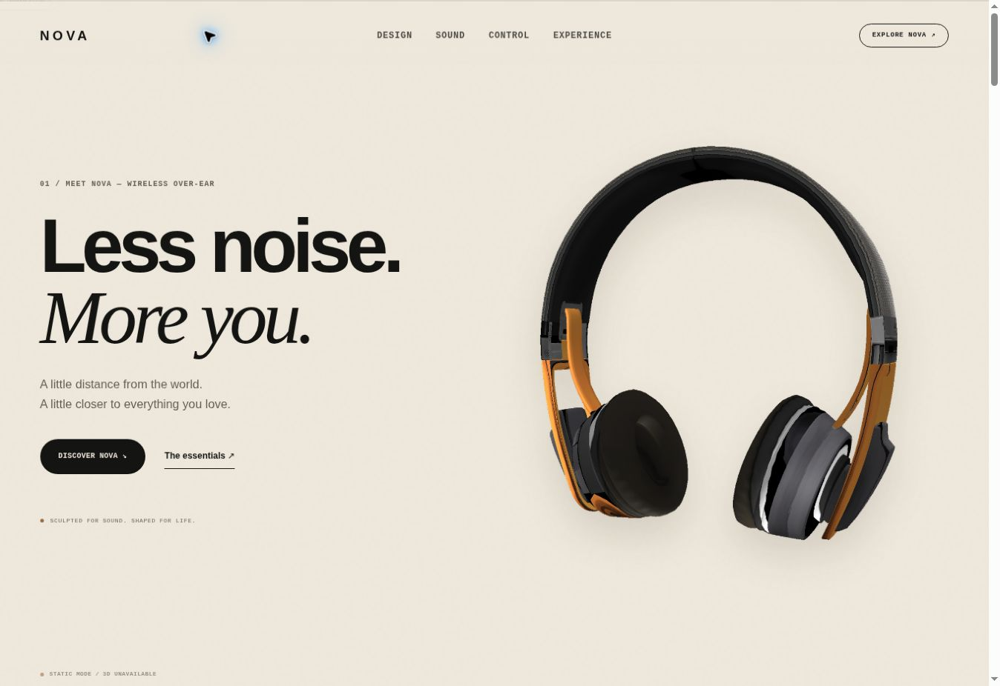

# Release verification — 4 October 2026

- Eight JavaScript suites passed, including launch chapter mapping, 30/60 fps
  camera equivalence, inspection reset, fold retargeting, and reduced-motion
  endpoints. Legacy suites remain for the preserved runtime modules.
- 45 Python contract checks passed for source structure, navigation, semantic
  controls, asset presence, accessible references and specification disclosures.
- 35 CPU projections passed: every visible skinned vertex at the settled poses
  for seven chapters and five desktop/tablet/mobile viewport sizes. This checks
  framing; it does not measure GPU performance or certify every intermediate
  animation frame.
- Live browser checks on the `new` Pages alias: hero poster loaded at 1200 px;
  Sound navigation landed at full opacity; AAC and Aware changed their pressed
  states and explanatory copy; specifications opened; the background became
  inert; Tab stayed in the dialog; Escape closed it and restored trigger focus.
- The supplied cloud browser cannot create a WebGL context (`GL_RENDERER =
  Disabled`). The screenshot therefore shows the real-model static fallback.
  Live GPU rendering, frame rate and interactive 3D appearance remain unverified
  in this browser. Mobile geometry was checked numerically, not visually in a
  mobile browser.

