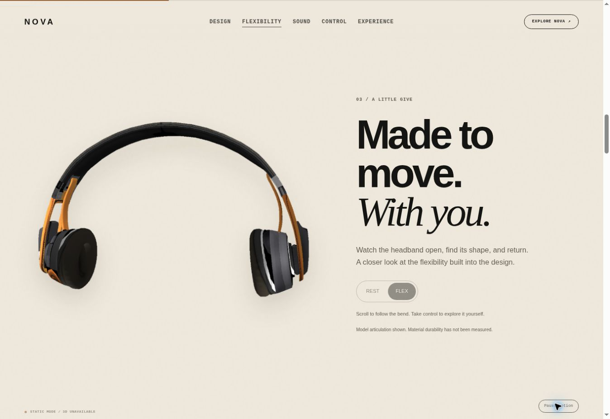

# NOVA new1 — flexibility and living motion

5 October 2026 (Asia/Dhaka). Based on launch commit
`c270c075cfe53e75c3e99a4030b6461414c8d0e5`.

The added chapter demonstrates the source headband bend (clip positions
0.24–0.30), with Rest/Flex controls. Portability uses the separate compact fold
(0.82–0.92). Joint-space interpolation prevents transitions between these
gestures from scrubbing unrelated twists in the original animation.

Secondary movement adds a slow vertical float, gentle rotation, a reading orbit,
and a small lighting shift. It yields to inspection and focused hotspots.
Ambient motion can be paused; reduced-motion mode removes the continuous motion.

## Checks

- Nine JavaScript suites passed, including gesture isolation, joint interpolation
  at 30/60 fps, reduced-motion endpoints and interaction ownership.
- 46 Python contract checks passed.
- 960 full skinned-mesh projections passed: eight chapters, five viewport sizes,
  eight scroll positions and three ambient phases. Mobile bend framing was
  reduced after these checks caught side clipping.
- The flexibility poster is rendered from the same source model at pose 0.30;
  its complete silhouette fits the image.
- Browser review of the release candidate confirmed direct flexibility navigation
  lands at full opacity and displays the bent product poster. Pause/Resume changed
  both its pressed state and computed CSS animation state (paused/running).
- The cloud browser has WebGL disabled. Browser visuals therefore show the
  fallback. These checks do not certify live GPU performance, every intermediate
  joint blend, or real mobile browser behavior.

The prior `new` release is preserved independently; `new1` is the refined release.

